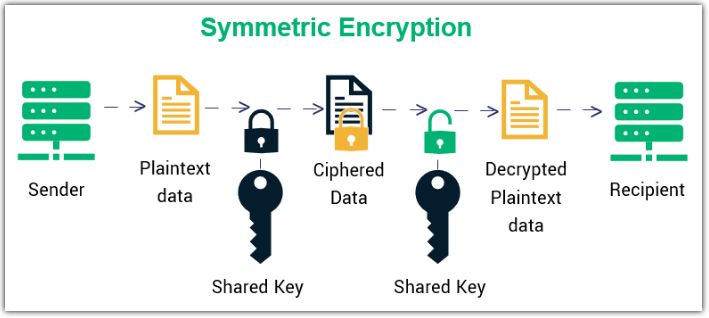

# Symmetrical Encryption Main Information.

## Contents at a Glance.
* [About](#about)
* [Documentation.](#documentation)
* [Symmetrical Encryption Examples](#symmetrical-encryption-examples)
* [Pros.](#pros)
* [Cons.](#cons)
* [Help](#help)

## About.

## Documentation.
#### Symmetrical Encryption.

## Symmetrical Encryption Examples.
* AES (Rijndael).
* Twofish.
* Serpent.
* DES.

## Pros.
* Fast.
* Efficient for large data.

## Cons.
* Hard to transport shared key.

## Help.
